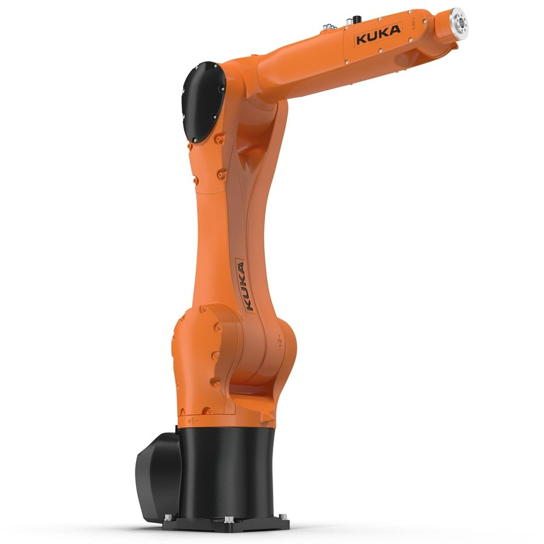
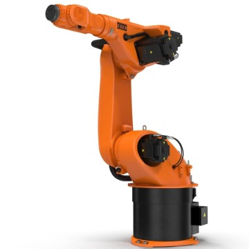
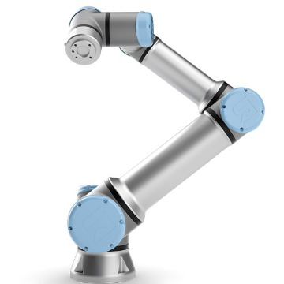
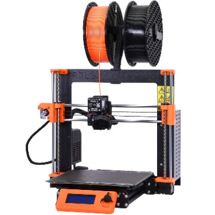
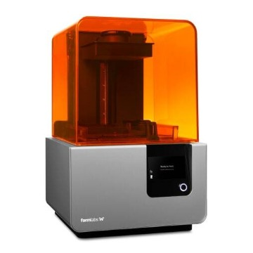

# Technologies
{: .no_toc }

A list of all the various pieces of equipment
{: .fs-6 .fw-300 }

## Robots

.
.

.
.

## 3D printers
.
.

  

    

      <!-- Safe zone, enter your custom markup -->
      
      <!-- Safe zone ends -->
    

  

  

    

      <figure>
        
        <figcaption>Caption goes here</figcaption>
      </figure>
    

  

